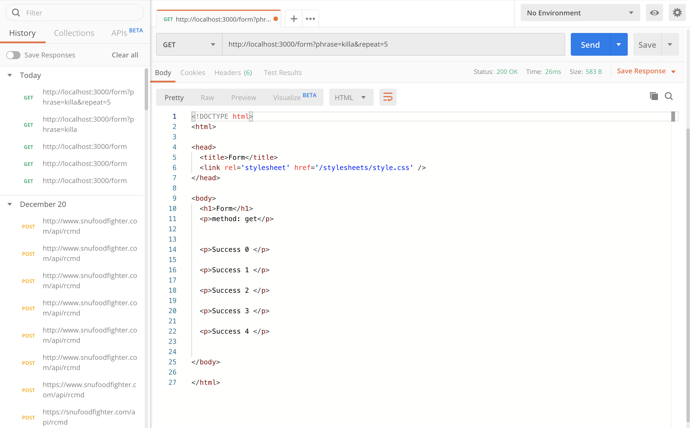
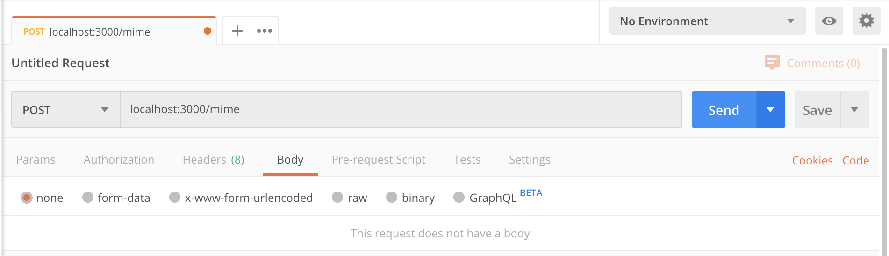
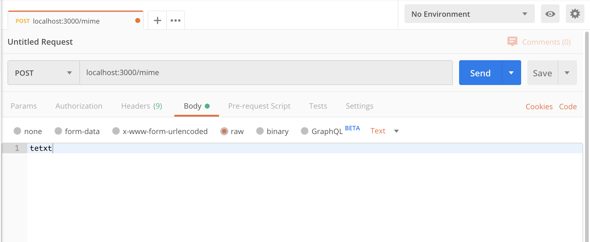
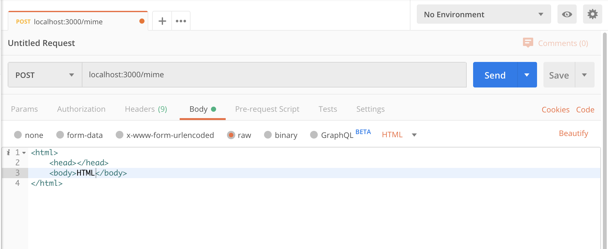
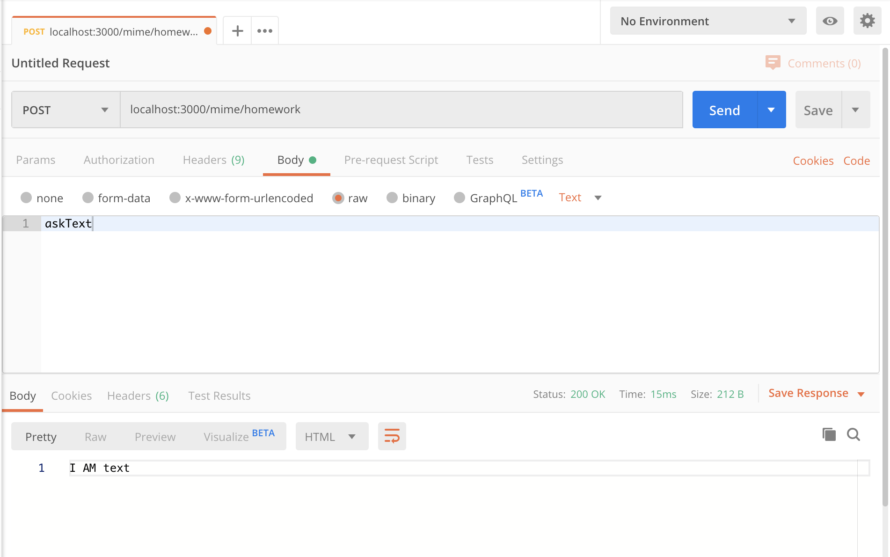

## WaaS Express

## I. 안내
### I-1. 과제 하는 방법
* 신입생 여러분들을 위한 express 예제 page 입니다.
* 매일 하루 안에 수행할 수 있는 과제를 1개씩 내드릴 겁니다.
* 각자 과제를 수행하면 fork한 자신의 github repo의 readme에 다음과 같은 형식으로 작성하면 됩니다.

``` markdown
### 12월 23일
* todo list의 제목을 "HelloTODO"로 하기 위해서는 localhost:3000/todo________ 로 접근해야 함
```

* 하루 안에 해결할 수 있는 과제로 월~금 수행을 하고 나면 토요일까지 기한을 드리고 수합해 검사할 예정이고, 그 사이 기간에도 자유롭게 질문을 진행하시면 됩니다.
    * URL을 해당 주 금요일까지 @정연길 에게 제출해주시면 됩니다.

### I-2. 멘토 제도
* 12월 23일 ~ 27일 주가 지나고 남은 학생들에 대해서는 WaaS 팀 멤버들이 멘토로 붙어 별도로 웹개발 학습에 대한 조언을 드릴 예정입니다. 

### II. 과제

#### 12월 23일
1. 제공된 express 서버를 구동한다.
2. localhost:3000/todo에 접근해보고, 상단의 제목을 "HelloTODO"로 하기 위해서는 **어떤 URL로 접근해야 하는지 찾아 작성한다.**
    * Hint: get parameter
    * Hint2: req의 input 종류 - params, query, body, cookie
3. 2번을 수행해봤다면 EJS의 의미를 대략 이해할 수 있음. EJS는 HTML에 server의 parameter를 포함시켜 전송할 수 있도록 해주는 module이다.

#### 12월 24일
1. 제공된 express 서버를 구동한다.
2. localhost:3000/form에 **postman**을 이용해 접근해보고, 아래와 같이 결과를 얻으려면 설정해야 하는 **URL, query, body** 설정을 기록한다.
    * 예시
    
    * **과제 문제**
        1. GET 요청, success가 3번 반복될 것
        2. POST 요청, success가 7번 반복될 것
        3. PUT 요청, success가 5번 반복될 것
        4. DELETE 요청, success가 1번 반복될 것
    * 기존에 올려줬던 PPT의 HTTP Method를 결부해 이해하면 좋을 것 같습니다.
    * Hint: Body 입력 시 "x-www-form-urlencoded"를 선택하세요!
3. readme.md에 작성되어 있는 형식을 참고헤 2의 4가지 결과의 screenshot을 같이 첨부한다.

#### 12월 25일: HTTP Header, File Type
HTTP header의 항목은 다음과 같이 나뉠 수 있다.
* general header
* entity header
* request header
* response header

Header를 통해 content 외의 정보를 담아 cache, cookie, CORS 등 다양한 setup이 가능하다.
그 중 이번에 살펴볼 부분은 file type과 이에 따른 static content(이미지 등)을 serve하는 방법에 대해 익힐 것이다.

##### Content-type
content-type은 request나 response하는 body에 대한 정보를 담고 있는 entity header에 포함된다. entity header에는 encoding, type, length 등의 정보가 담긴다.

content-type은 MIME type에 따라 전송되는 body의 content의 file 종류를 정의한다. 

|타입 |설명 |일반적인 서브타입 예시 |
|-|-|-|
|text|텍스트를 포함하는 모든 문서를 나타내며 이론상으로는 인간이 읽을 수 있어야 합니다|text/plain, text/html, text/css, text/javascript|
|image|모든 종류의 이미지를 나타냅니다. (animated gif처럼) 애니메이션되는 이미지가 이미지 타입에 포함되긴 하지만, 비디오는 포함되지 않습니다.|image/gif, image/png, image/jpeg, image/bmp, image/webp|
|audio|모든 종류의 오디오 파일들을 나타냅니다.|audio/midi, audio/mpeg, audio/webm, audio/ogg, audio/wav|
|video|모든 종류의 비디오 파일들을 나타냅니다.|video/webm, video/ogg|
|application|모든 종류의 이진 데이터를 나타냅니다.|application/octet-stream, application/pkcs12, application/vnd.mspowerpoint, application/xhtml+xml, application/xml,  application/pdf|
ref 1: https://developer.mozilla.org/ko/docs/Web/HTTP/Basics_of_HTTP/MIME_types
ref 2: https://developer.mozilla.org/ko/docs/Web/HTTP/Basics_of_HTTP/MIME_types/Complete_list_of_MIME_types

기존에 text/html, text/plain의 경우 간단한 webserver를 작성해보며 경험해 보았을 겁니다. file의 종류에 따라 적절한 MIME type을 지정하지 않을 경우 file을 읽어내지 못하는 오류를 겪게 됩니다. 

현재 작성되어 있는 webserver project에서 보내볼 filetype은 다음과 같습니다.
* undefined, text/plain, text/html, application/json
받아볼 type은 다음과 같습니다.
* text/plain, text/html, application/json, image/*

#### 실습: 전송
다양한 type이 적용된 file을 postman을 통해 전송해 보겠습니다.
##### 1. undefined

##### 2. text/plain

##### 3. text/html

##### 4. application/json


위와 같은 설정으로 전송해보고 MIME type이 정상적으로 돌아오는지 확인해보세요!

#### 과제: response capture
postman으로 전송된 결과를 capture해 upload하면 됩니다.
해당 경우의 request 설정도 확인할 수 있도록 capture해 업로드해주세요.

Ex) 


#### 12월 26일: login 구현체 파악과 response code 이해
1. 다음의 module이 추가 되었습니다, npm install을 통해 추가 module을 설치해주세요.
* `cookie-parser`: cookie data parse
* body-parser의 경우 설치하지 않고 express inline을 활용했음

2. 이번 구현체는 cookie를 이용한 간단한 login 서비스 입니다.
* 유의해야할 점: 보안적으로 매우 취약합니다, 이해를 돕기 위해 쉽게 구현되어 있음
    * cookie가 아닌 session이 적절함
    * SSL확보를 위해 https로 전환해야 함
    * 높은 보안성을 필요로 하는 경우, SSL외에도 client에서 공개키 암호화한 text를 server에게 전송해야 함
    * server에 저장하는 login 정보는 hash 처리되어야 함

`routes/login.js` 코드를 보고 파악해야 하는 사항은 다음과 같습니다.
* cookie-parser와 cookie 설정법
* cookie의 timeout, age
* chrome 개발자 도구 > applications > cookie에서 cookie가 생긴 것을 확인 (**screenshot 기록해둘 것**)
* login process과 redirect의 response code
* `/login/isLoggin`에서 400, 200 response code 확인

### 12월 27일: login 구현체 수정
26일의 구현체를 살펴보면 1개의 ID로만 로그인을 하는 상황입니다.
각자 새로운 로그인 ID를 생성해 집어넣고, waas가 아닌 id로 로그인한 경우 `/login/isLogin`에서 forbidden(403)을 띄워주도록 구현체를 수정해주세요.
수정한 부분에 대한 간단한 설명과, screeenshot을 같이 첨부해주시면 됩니다.
