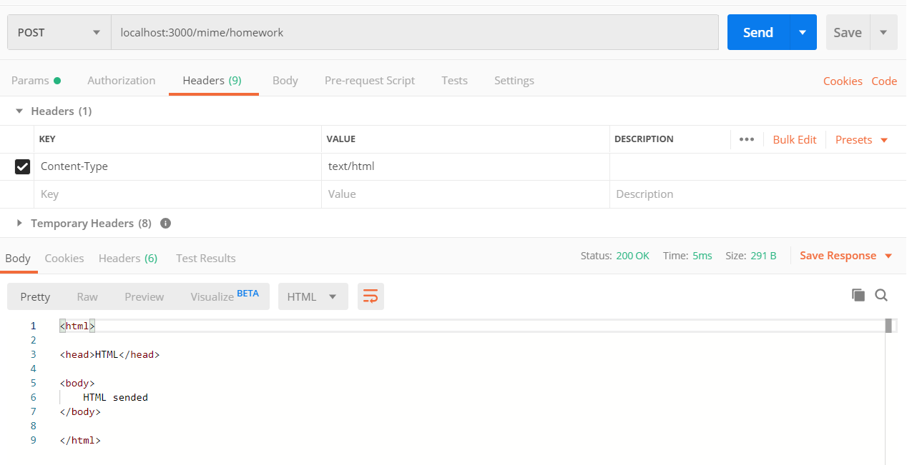

## WaaS Express

## 과제

### 12월 23일
* todo list의 제목을 "HelloTODO"로 하기 위해서는 localhost:3000/todo?title=HelloTODO 로 접근해야 함

### 12월 24일
* GET

* POST

* PUT

* DELETE

### 12월 25일
* text/html

* application/json

    * mime.js 파일을 수정했음.

* text/plain

* text/plain & image

### 12월 26일: login 구현체 파악과 response code 이해
1. 다음의 module이 추가 되었습니다, npm install을 통해 추가 module을 설치해주세요.
* `cookie-parser`: cookie data parse
* body-parser의 경우 설치하지 않고 express inline을 활용했음

2. 이번 구현체는 cookie를 이용한 간단한 login 서비스 입니다.
* 유의해야할 점: 보안적으로 매우 취약합니다, 이해를 돕기 위해 쉽게 구현되어 있음
    * cookie가 아닌 session이 적절함
    * SSL확보를 위해 https로 전환해야 함
    * 높은 보안성을 필요로 하는 경우, SSL외에도 client에서 공개키 암호화한 text를 server에게 전송해야 함
    * server에 저장하는 login 정보는 hash 처리되어야 함

`routes/login.js` 코드를 보고 파악해야 하는 사항은 다음과 같습니다.
* cookie-parser와 cookie 설정법
* cookie의 timeout, age
* chrome 개발자 도구 > applications > cookie에서 cookie가 생긴 것을 확인 (**screenshot 기록해둘 것**)
* login process과 redirect의 response code
* `/login/isLoggin`에서 400, 200 response code 확인

### 12월 27일: login 구현체 수정
26일의 구현체를 살펴보면 1개의 ID로만 로그인을 하는 상황입니다.
각자 새로운 로그인 ID를 생성해 집어넣고, waas가 아닌 id로 로그인한 경우 `/login/isLogin`에서 forbidden(403)을 띄워주도록 구현체를 수정해주세요.
수정한 부분에 대한 간단한 설명과, screeenshot을 같이 첨부해주시면 됩니다.
