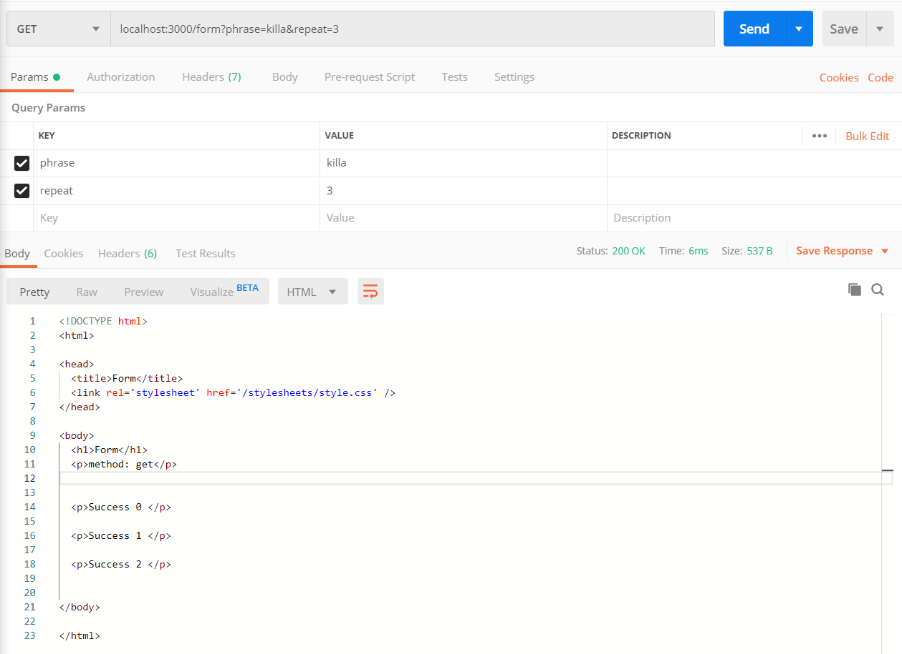

## WaaS Express

## 과제

### 12월 23일
* todo list의 제목을 "HelloTODO"로 하기 위해서는 localhost:3000/todo?title=HelloTODO 로 접근해야 함


### 12월 24일
* GET


* POST


* PUT


* DELETE


### 12월 25일
* text/html


* application/json

    * mime.js 파일을 수정했음.

* text/plain


* text/plain & image


### 12월 26일

* cookie-parser 사용법
```javascript
var express = require('express');
var cookieParser = require('cookie-parser');

var app = express();
app.use(cookieParser());

app.get('/', function(req, res) {
    console.log('Cookies: ', req.cookies)
})
```

* 브라우저에서 cookie 생성
```javascript
res.cookie('name', 'waas', {
      maxAge: 30000
    })
```

* cookie의 timeout, age
    - cookie 생성 옵션 중 maxAge 값을 통해 cookie의 age를 설정할 수 있다.
        - 상단 코드에서는 maxAge를 30000ms, 즉 30초로 설정하였다.
    - 이 외에도 `expires`, `path`, `domain`, `secure` 등 여러 option이 존재한다.

* chrome 개발자 도구 > applications > cookie에서 cookie가 생긴 것을 확인 


* login process과 redirect의 response code
    - login.ejs에서 post 방식으로 id와 pw를 전달한다.
    ```html
    <form method="post">
            ID: <input name="id"/><br/>
            PW: <input name="pw" type="password"/><br/>
            <input type="submit" value="로그인"/>
        </form>
    ```
    - login.js에서 <id, pw>가 <'waas', 'team'>이라면 cookie를 생성한다.
    - 302 response code로 redirect 한다.(개발자도구 > Network에서 확인 가능)

* `/login/isLoggin`에서 400, 200 response code 확인
    - cookie name이 존재하면 304 response code와 'waas team'
    - 그렇지 않으면 401 response code와 'unauthorized'

### 12월 27일: login 구현체 수정

* 구현체 수정
    ```javascript
    if(req.body.id !== '' && req.body.pw !== '') {
        res.cookie('name', req.body.id, {
            maxAge: 30000   // 30000밀리초 → 30초
        })
    }
    ```
    * id와 pw가 빈 문자열만 아니면 쿠키를 생성하도록 수정하였다.

    ```javascript
    if(req.cookies.name !== 'waas') {
        return res.status(403).send("Forbidden");
    }
    return res.status(200).send("waas team");
    ```
    * cookie value가 'waas'가 아니면 403 response code와 'Forbidden'을 띄우도록 수정하였다.

